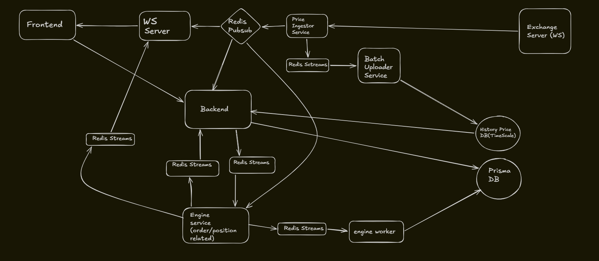

# TradeON

A real-time cryptocurrency trading platform built as a Turborepo monorepo. TradeON includes a Next.js trading dashboard, an Express backend, WebSocket live updates, Redis-backed event flows, a memory-first execution engine, PostgreSQL persistence, and TimescaleDB market history.

## System Architecture



**How data moves through the system:**

1. **Live market data** - the price ingestor receives exchange prices and publishes them into Redis pub/sub and Redis streams.
2. **Price broadcasting** - the WebSocket server reads live prices and pushes updates to the trading dashboard.
3. **Order placement** - the backend validates orders, reserves margin, stores the order, and writes an outbox event for the engine flow.
4. **Execution** - the engine keeps open orders and positions in memory for fast execution, close, TP/SL, and liquidation handling.
5. **Persistence** - engine events are consumed by the engine worker, which updates orders, positions, wallets, and ledger entries in PostgreSQL.
6. **Historical data** - raw market ticks are uploaded into TimescaleDB for candle and chart queries.

## Features

- Live BTC, ETH, and SOL market prices
- Real-time charting with historical candles
- Email/password authentication with HTTP-only JWT cookies
- Wallet deposit flow and available/locked balance tracking
- Leveraged market order placement
- In-memory position lifecycle management
- Manual close, take-profit, stop-loss, and liquidation flow
- User-specific WebSocket updates for account and position changes
- Redis streams for command, persistence, tick, and user-event pipelines
- TimescaleDB schema setup for tick and candle storage
- Docker Compose setup for local or VPS-style deployment

## What's Inside

### Applications

| App | Path | Description | Port |
| --- | --- | --- | --- |
| Web | `apps/web` | Next.js frontend with landing page, auth pages, and trading dashboard | `3000` |
| Backend | `apps/Backend` | Express REST API for auth, wallet, orders, positions, and market data | `8000` |
| WS | `apps/ws` | WebSocket server for live prices and user-specific events | `8080` |
| Engine | `apps/engine` | Memory-first execution service for orders, positions, TP/SL, and liquidations | - |
| Engine Worker | `apps/engine-worker` | Async persistence worker for engine events and order outbox flow | - |
| Price Ingestor | `apps/price-ingestor` | Connects to the exchange WebSocket and publishes market data | - |
| Batch Uploader | `apps/batch-uploader` | Consumes tick streams and writes historical data to TimescaleDB | - |

### Frontend Pages

| Route | Description |
| --- | --- |
| `/` | Landing page |
| `/auth/login` | Login page |
| `/auth/signup` | Signup page |
| `/dashboard` | Trading dashboard with chart, order ticket, positions, history, and wallet actions |

### Shared Packages

| Package | Purpose |
| --- | --- |
| `@repo/config` | Shared environment validation |
| `@repo/db` | Prisma schema, migrations, generated client, and database connection |
| `@repo/redis` | Redis client, stream names, stream helpers, user events, and engine events |
| `@repo/market` | Live price cache and shared market state |
| `@repo/timescaledb` | TimescaleDB client and schema setup |
| `@repo/schemas-types` | Shared request schemas and domain validation |
| `@repo/typescript-config` | Shared TypeScript configuration |
| `@repo/eslint-config` | Shared linting configuration |

## Redis Streams And Pub/Sub

| Channel / Stream | Producer | Consumer | Purpose |
| --- | --- | --- | --- |
| `price:*` | `price-ingestor` | `backend`, `ws`, `engine` through `@repo/market` | Fast transient live price cache |
| `market-events` | `price-ingestor` | `engine` | Price events used for TP/SL and liquidation checks |
| `market-ticks` | `price-ingestor` | `batch-uploader` | Tick persistence into TimescaleDB |
| `stream.orders` | `engine-worker` outbox publisher | `engine-worker` order loader | Reliable order handoff from DB outbox into the engine command flow |
| `stream.engine.commands` | `backend`, `engine-worker` order loader | `engine` | Engine commands such as order load, close position, and live state request |
| `stream.engine.db` | `engine` | `engine-worker` | Async DB persistence after memory-first engine actions |
| `user-events` | `engine`, `engine-worker` | `ws` | User-specific frontend updates |
| `stream.engine.snapshot:*` | `backend`, `engine` | `backend`, `engine`, `engine-worker` | Temporary request/response streams for live state, close responses, and engine startup hydration |
| `stream.engine.dead-letter` | stream failure handler | manual inspection / future recovery worker | Failed messages after retry handling |

## Core Flows

### Live price flow

1. `price-ingestor` connects to the exchange WebSocket.
2. Latest prices are published to Redis pub/sub channels.
3. `backend`, `ws`, and `engine` maintain their own in-memory live price cache.
4. Tick events are also written to Redis streams for TimescaleDB persistence.

### Order flow

1. Frontend submits an order to the backend.
2. Backend validates the request and reserves margin in the wallet.
3. Order data and an `order.created` outbox event are stored in PostgreSQL in the same transaction.
4. Engine worker publishes the outbox event into `stream.orders`.
5. Engine worker loads the pending order and sends `order.loaded` to `stream.engine.commands`.
6. Engine executes the order in memory and opens or rejects the position.
7. Engine publishes DB events for persistence and user events for immediate frontend updates.

### Position flow

1. Engine tracks open positions in memory.
2. Market events trigger unrealized PnL, TP/SL, and liquidation logic.
3. Manual close requests go from backend to engine through Redis streams.
4. Engine worker persists the final state into PostgreSQL.
5. WebSocket server pushes account and position updates to the frontend.

### Historical candle flow

1. Price ingestor emits raw market ticks.
2. Batch uploader writes ticks into TimescaleDB.
3. Timescale continuous aggregates build candle data.
4. Backend serves historical candles to the dashboard.

## Getting Started

### Prerequisites

- Bun `1.3.11`
- Docker and Docker Compose
- Node.js `18+`

Install dependencies:

```bash
bun install
```

Create and configure the root `.env` file:

```env
DATABASE_URL=
TIMESCALE_DATABASE_URL=
REDIS_URL=
JWT_SECRET=
NODE_ENV=development
BACKPACK_WS_URL=wss://ws.backpack.exchange
COOKIE_DOMAIN=
NEXT_PUBLIC_API_URL=http://localhost:8000/api/v1
NEXT_PUBLIC_WS_URL=ws://localhost:8080
```

Set up Prisma and TimescaleDB schemas:

```bash
bun run setup
```

Run all services in development:

```bash
bun run dev
```

Useful commands:

```bash
bun run build
bun run check-types
bun run lint
bun run db:generate
bun run db:migrate
bun run timescale:schema
```

## Docker

The repository includes service-level Dockerfiles and a root Docker Compose file.

Start the full stack:

```bash
docker compose up --build
```

Compose service URLs:

| Service | URL |
| --- | --- |
| Web | `http://localhost:3000` |
| Backend API | `http://localhost:8000/api/v1` |
| Backend health | `http://localhost:8000/health` |
| WebSocket | `ws://localhost:8080` |
| PostgreSQL | `localhost:5432` |
| TimescaleDB | `localhost:5433` |
| Redis | `localhost:6379` |

The current `docker-compose.yml` builds the web app with production API and WebSocket URLs. For a fully local Docker run, change the `NEXT_PUBLIC_API_URL` and `NEXT_PUBLIC_WS_URL` build args to the localhost values shown in the environment example above.

## Technology Stack

- **Frontend**: Next.js, React, TypeScript, Tailwind CSS, lightweight-charts, Axios, Zustand
- **Backend**: Express, TypeScript, JWT auth, cookie-based sessions
- **Realtime**: WebSocket server, Redis pub/sub, Redis streams
- **Engine**: in-memory order and position execution flow
- **Persistence**: PostgreSQL, Prisma, ledger and wallet state
- **Market history**: TimescaleDB, tick storage, candle aggregation
- **Monorepo**: Turborepo, Bun workspaces
- **Deployment**: Docker, Docker Compose, Nginx reverse proxy on VPS

## Project Status

TradeON is functional and deployed, with the main platform flows in place:

- live market feed
- dashboard UI
- auth and wallet flow
- order placement
- open and closed positions
- liquidation handling
- background persistence
- historical chart data

The next improvement areas are deployment hardening, Docker image optimization, observability, and deeper trading-system behavior.
